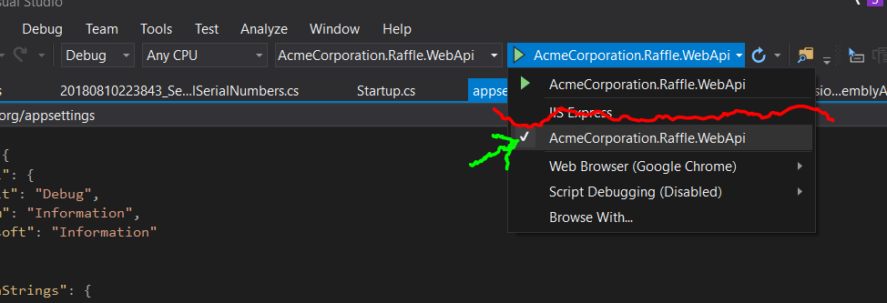

# Acme Corporation

This projects has been created as part of the Umbraco new hire coding challenge, so lets go!

# Prerequisites

  - Latest version of [Node.js](https://nodejs.org/)
  - The latest version of [.Net core](https://download.microsoft.com/download/4/0/9/40920432-3302-47a8-b13c-bbc4848ad114/dotnet-sdk-2.1.302-win-gs-x64.exe)

#2 Installation
 1. Go fetch the code `git clone https://github.com/mclausen/AcmeCorporation.git`
 2. Make sure you have installed angular cli globally. You can install it by opening your favorite powershell editor and go `npm install -g @angular/cli`
 3. Spin up your console and navigate to '<directory you cloned the project>\Src\AcmeCorporation-Client' and run `npm install` to restore node dependencies
 4. Open '<directory you cloned the project>\Src\AcmeCorporation.Raffle.WebApi\appsettings.Development.json' and insert the connection string to your database. Example `Data Source=(localdb)\\.\\sharedlocaldb;Initial Catalog=AcmeCorporationDraw;MultipleActiveResultSets=True;` (Make sure Initial Catalog is set to **AcmeCorporationDraw**)

## Run
### Server

**The visual studio way**
You can easily run the web server from visual studio by selecting **AcmeCorporation.Draw.WebApi** and hit F5.
Make sure that you run it as console and not under IISExpress

**The Console way**
if the console is your prefered weapon of choice you can go to the console and type the following commands
 1. `dotnet build`
 2. `dotnet run`

### Client

 1. Open your favorite powershell editor and navigate to '<directory you cloned the project>\Src\AcmeCorporation-Client' and run `ng serve`
 2. Open your browser and go to http://localhost:4200
